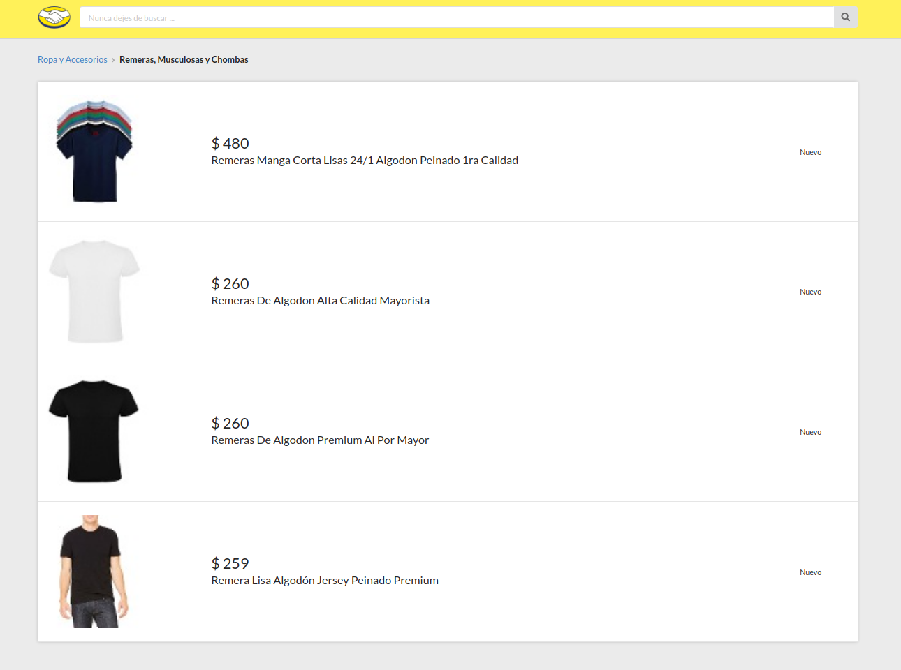

# Meli

This project is a fullstack challenge compound by an ecommerce site built with next.js and a custom server leveraging express.js

The application so far presents the following features:

<ul>
<li>Server and client side rendering for better SEO performance.</li>
<li>Cache requests via REDIS.</li>
<li>Pages responsiveness and overall styling via CSS grid and Flexbox.</li>
</ul>

Here's a screenshot of one of the pages:

<p align="center">
    
</p>

## How to run it ?

First, as usual clone the repo:

```console
foo@bar:~$ git clone https://github.com/wwleak/meli.git
```
Install && start redis:

```
foo@bar:~$ sudo apt-get install redis-server && redis-server
```

Then install all the dependencies

```console
foo@bar:~$ npm i
```
Lastly run the application

```console
foo@bar:~$ npm run dev
```

<p align="right">MADE WITH ❤ BY ABRAHAM</p>
